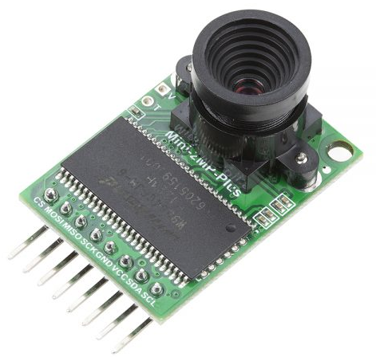
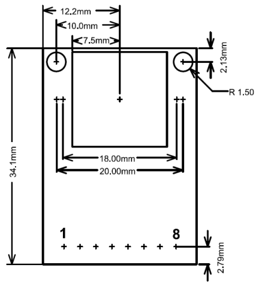
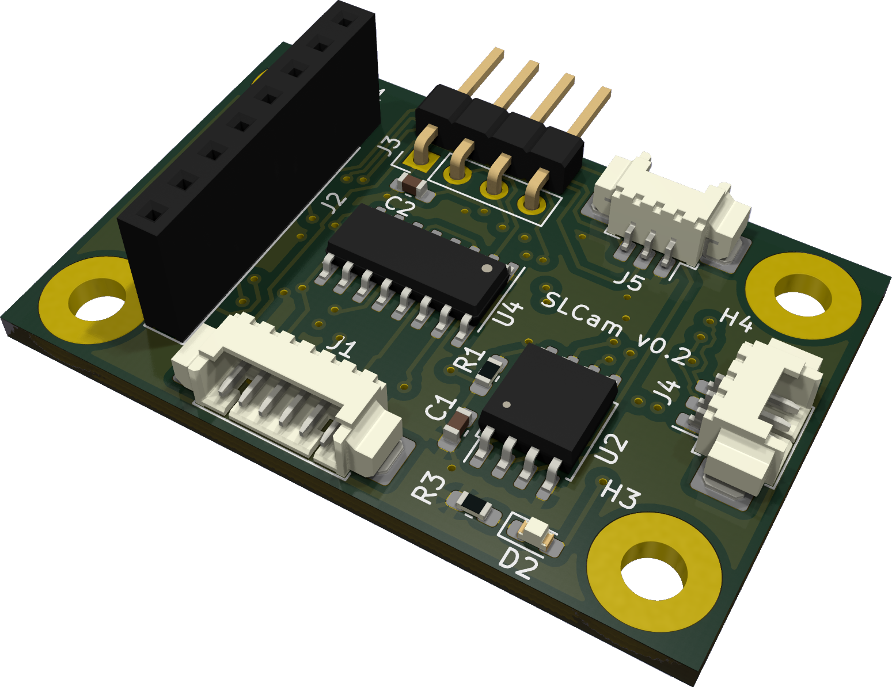
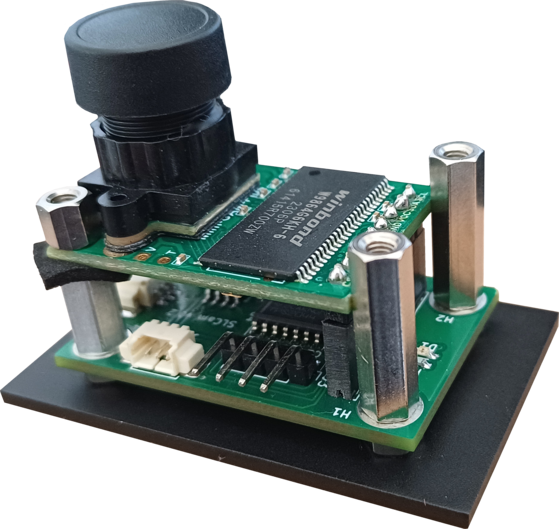

.. hardware.rst

   Copyright The SLCam Contributors.

   SLCam Documentation

   This work is licensed under the Creative Commons Attribution-ShareAlike 4.0
   International License. To view a copy of this license,
   visit http://creativecommons.org/licenses/by-sa/4.0/.

********
Hardware
********

This chapter presents a description of the hardware project of the SLCam payload. As the primary reference, a block diagram can be seen in :numref:`fig:block-diagram`.

.. _fig:block-diagram:

.. figure:: img/block-diagram.*
      :width: 80%
      :align: center
      :alt: Block diagram 

      Block diagram of the SLCam hardware.

As can be seen in the block diagram, the hardware design of the module can be divided into two parts: the image sensor and the camera control board.

The following sections present a further description of each part of the hardware.

Image Sensor
============

The image sensor used in the SLCam module is the Arducam Mini 2MP Plus camera module :cite:`arducam`. This module is based on the OV2640 image sensor and provides a compact and low-power solution for embedded imaging applications. It supports image resolutions up to 1600 :math:`\times` 1200 pixels and communicates with the main controller through an I\ :sup:`2`\ C and an SPI interface.

In addition to integrating the image sensor itself, the module also includes onboard FIFO memory, allowing image buffering and simplified data acquisition by the host microcontroller. Due to its reduced size, low power consumption, and ease of integration, the Arducam Mini 2MP Plus was selected as the primary imaging device for the SLCam payload.

A photograph of the Arducam Mini 2MP Plus module is shown in :numref:`fig:arducam`. The top and bottom view of the board can also be seen in :numref:`fig:arducam-top-bottom`.

.. _fig:arducam:

      Arducam Mini 2MP Plus.

.. _fig:arducam-top-bottom:

.. subfigure:: AB
    :layout-sm: A|B
    :gap: 8px
    :subcaptions: below
    :name: arducam_board
    :class-grid: outline
    :align: center

    .. image:: img/arducam-top.jpg
        :width: 70%
        :align: center
        :alt: Top view.

    .. image:: img/arducam-bottom.jpg
        :width: 70%
        :align: center
        :alt: Bottom view.

    Arducam Mini 2MP Plus top and bottom view.

The internal architecture of the Arducam Mini 2MP Plus module is illustrated in the block diagram shown in :numref:`fig:arducam-block-diagram`. The module is centered around the OV2640 image sensor and the ArduChip controller, which is responsible for image acquisition, buffering, and communication with the host system.

.. _fig:arducam-block-diagram:

.. figure:: img/arducam-block-diagram.png
      :width: 100%
      :align: center
      :alt: Block diagram Arducam

      Block diagram of the Arducam Mini 2MP Plus.

The image sensor is connected to the ArduChip through a dedicated camera interface, responsible for receiving pixel data and synchronization signals. Internally, the ArduChip includes a Frame Buffer Finite State Machine (FSM) and memory timing control logic, which manage the storage and retrieval of image data from the external FIFO memory. This architecture allows complete image frames to be temporarily buffered before being transmitted to the host microcontroller.

Communication with the host system is performed through an SPI slave interface, using the standard signals CS, MISO, MOSI, and SCLK. Additionally, the image sensor configuration is performed through an I\ :sup:`2`\ C-compatible interface using the SDA and SCL signals. A register module is also available inside the ArduChip, enabling configuration and control of the camera operation and memory management functions.

The connection between the Arducam module and the control board is made using an 8-pin vertical header connector. Since the Arducam module originally comes with a horizontal pin header connector, it must be replaced with a vertical connector during the assembly of the SLCam device.

For integration purposes, the dimensions of the Arducam board are available in :numref:`fig:arducam-dimensions`.

.. _fig:arducam-dimensions:

      Arducam Mini 2MP Plus dimensions.

Controller Board
================

The camera control board is responsible for managing the operation of the SLCam module and interfacing the image sensor with external systems. As illustrated in the block diagram, the control board is centered around the STM32F103C8T6 microcontroller, which performs image acquisition control, communication management, data processing, and system supervision. The microcontroller communicates with the image sensor through SPI and I\ :sup:`2`\ C interfaces, using a dedicated image sensor connector that also provides the 3V3 power supply required by the camera module.

For non-volatile data storage, the control board includes a W25Q128JVSIM NOR Flash memory device connected through the SPI bus. This memory is used for image storage, buffering, and firmware-related data retention. External communication with host systems can be performed through both SPI and CAN interfaces, providing redundant communication channels for control and image transfer operations. The CAN interface is implemented using the TCAN330GD CAN transceiver, which provides the physical layer interface between the microcontroller and the external CAN bus network.

The board also provides dedicated UART and JTAG connectors for debugging and firmware programming purposes. The UART interface allows access to system logs and command-line interaction, while the JTAG connector enables firmware upload and low-level debugging of the microcontroller.

Power distribution and protection are managed through the TPS2010AD power switch device, which controls the power supplied to the image sensor module. The switch is controlled by a GPIO signal from the microcontroller, allowing the firmware to enable or disable the camera module dynamically for power management and fault recovery purposes. Together, these components form a compact and modular camera controller architecture suitable for embedded and small satellite applications.

A picture of the controller board is shown in :numref:`fig:controller`.

.. _fig:controller:

      Controller board.

A list with the components and part numbers of the controller board is available in :numref:`tab:controller-bom`.

.. _tab:controller-bom:

.. list-table:: Components of the controller board.
   :widths: 30 35 25 10
   :width: 100%
   :align: center
   :header-rows: 1

   * * Component
     * Description
     * Part Number
     * Quantity
   * * Microcontroller
     * ARM Cortex M3
     * STM32F103C8T6
     * 1
   * * Flash Memory
     * NOR 128 Mbit
     * W25Q128JVSIM TR
     * 1
   * * Switch
     * Load switch
     * TPS2010AD
     * 1
   * * CAN Transceiver
     * CAN transceiver
     * TCAN330GD
     * 1
   * * SPI/3V3 Connector
     * PicoBlade 6 pin
     * 532610671
     * 1
   * * UART Connector
     * PicoBlade 3 pin
     * 532610371
     * 1
   * * CAN Connector
     * PicoBlade 3 pin
     * 532610371
     * 1
   * * Image Sensor Connector
     * Female header 8 pin straight
     * -
     * 1
   * * JTAG Connector
     * Male header 4 pin angled
     * -
     * 1
   * * Crystal
     * 8 MHz crystal
     * ECS-80-10-33-CHN-TR3
     * 1

Printed Circuit Board
*********************

The controller board PCB was developed using the KiCad v5 tool :cite:`kicad` and was designed as a compact four-layer board. The multilayer structure improves signal integrity, simplifies power distribution, and reduces electromagnetic interference, which is particularly important for embedded systems operating with high-speed digital interfaces such as SPI and CAN.

The PCB was designed using standard FR-4 material with a total thickness of 1.6 mm. The engineering model uses a HASL (Hot Air Solder Leveling) surface finish, while the flight model is planned to use an ENIG (Electroless Nickel Immersion Gold) finish to improve corrosion resistance and soldering reliability. No special dielectric or impedance-controlled stack-up requirements were necessary for the current design.

Mechanically, the controller board measures 41.7 :math:`\times` 27.4 mm and includes four mounting holes with a diameter of 3.2 mm, allowing secure integration into the payload mechanical structure. The compact dimensions of the PCB contribute to the reduced size and mass of the SLCam module, making it suitable for small satellite and embedded imaging applications.

Top and bottom views of the controller board are presented in :numref:`fig:controller-board-top-bottom`, highlighting the component placement and routing distribution across the PCB layers.

.. _fig:controller-board-top-bottom:

.. subfigure:: AB
    :layout-sm: A|B
    :gap: 8px
    :subcaptions: below
    :name: controler_board
    :class-grid: outline
    :align: center

    .. image:: img/controller-top.png
        :width: 60%
        :align: center
        :alt: Top view.

    .. image:: img/controller-bottom.png
        :width: 60%
        :align: center
        :alt: Bottom view.

    Controller board top and bottom view.

Integration Between the Image Sensor and the Controller Board
=============================================================

The SLCam module is composed of two independent electronic boards: the Arducam Mini 2MP Plus image sensor board and the custom-developed controller board. The integration between these two boards is illustrated in :numref:`fig:boards-integration`.

.. _fig:boards-integration:

   Integration between the Arducam image sensor board and the controller board.

The controller board is positioned below the image sensor module and is responsible for power distribution, communication management, image acquisition control, and external interfacing of the SLCam module. The Arducam board is mounted above the controller board using metallic spacers that provide mechanical support, structural rigidity, and controlled spacing between the two PCBs.

The electrical connection between both boards is performed through a vertical pin header interface. Through this connector, the controller board provides the required 3V3 power supply to the image sensor module and establishes the SPI and I\ :sup:`2`\ C communication buses used for image transfer and camera configuration. The SPI interface is responsible for image data acquisition from the ArduChip FIFO memory, while the I\ :sup:`2`\ C bus is used for configuring the OV2640 image sensor registers and operating parameters.

As shown in :numref:`fig:boards-integration`, the optical axis of the camera module is aligned with the center of the mechanical enclosure opening, allowing unobstructed image acquisition. The stacked PCB arrangement contributes to reducing the overall footprint of the payload while maintaining accessibility to the external electrical interfaces located on the controller board.

Additionally, insulating foam spacers are positioned between the boards to reduce mechanical vibrations, minimize stress concentration during assembly, and prevent unintended contact between electronic components mounted on opposite PCB surfaces. This integration approach results in a compact, lightweight, and mechanically robust imaging subsystem suitable for embedded and nanosatellite applications.
