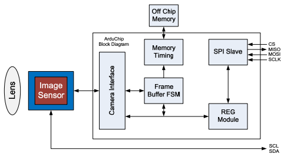

.. hardware.rst

   Copyright The SLCam Contributors.

   SLCam Documentation

   This work is licensed under the Creative Commons Attribution-ShareAlike 4.0
   International License. To view a copy of this license,
   visit http://creativecommons.org/licenses/by-sa/4.0/.

********
Hardware
********

This chapter presents a description of the hardware project of the SLCam payload. As the primary reference, a block diagram can be seen in :numref:`fig:block-diagram`. Also, a 3D model of both sides of the PCB is available in **TBD**.

.. _fig:block-diagram:

.. figure:: img/block-diagram.*
      :width: 80%
      :align: center
      :alt: Block diagram 

      Block diagram of the SLCam hardware.

The following sections present a further description of the hardware project.

Specifications
==============

The SLCam has the image sensor module Arducam Mini 2MP Plus, one microcontroller (STM32F103C8T6) that run at a clock of **TBD**, a RAM of 20 kB (SRAM), a flash memory of **64 or 128KBytes**. The SLCam also has a CAN Transceiver, a switch and many connectors such as CAN connector, JTAG, SPI/3V3 and one for the image sensor.

Image Sensor Connector
**********************

* **Sensor type**: RGB
* **Pixel size**: 2.2 :math:`\times` 2.2 :math:`\mu` m
* **Max. Resolution**: 1600 :math:`\times` 1200 px
* **Field of View (FoV)**: :math:`68^{\circ}` (6 mm) \textcolor{red}{TBC}
* **Storage**: 16 MB (Flash NOR)
* **Power supply**: 3V3 @ 140 mA \textcolor{red}{TBC}
* **Interfaces**:
  * **Control/Data**: SPI and/or CAN
  * **Debug**: UART
  * **Programming**: JTAG

In :numref:`fig:arducam-block-diagram`, it is shown the architecture of the image sensor module, which is a FPGA featuring a FIFO off chip memory and the OmniVision OV2640 as the image sensor. 

.. _fig:arducam-block-diagram:

      Architecture of the Arducam Mini 2MP Plus.

.. subfigure:: ABCD
    :layout-sm: A|B|C|D
    :gap: 8px
    :subcaptions: below
    :name: myfigure
    :class-grid: outline

    .. image:: img/arducam-top.jpg
        :align: center
        :alt: Top view.

    .. image:: img/arducam-bottom.jpg
        :width: 90%
        :align: center
        :alt: Bottom view.

    .. image:: img/arducam-2mp.png
        :align: center
        :alt: 2 MP Camera Module

    .. image:: img/arducam-dimensions.png
        :align: center
        :alt: Mechanical dimensions.

    Arducam Mini 2MP Plus Views and Dimensions.

Electrical Interfaces
=====================

Image Sensor Connector
----------------------

A connector 1x08 linking all pins from Arducam to the controller.

Dedicated Electrical Interfaces
-------------------------------

.. note::
   TODO: Change images!

.. list-table:: Dedicated electrical interfaces.
    :widths: 12 25 18 18 27
    :header-rows: 1

    * 
      - **Connector**
      - **Image**
      - **Interface**
      - **Type**
      - **Pins**
    * 
      - J1
      - .. image:: img/arducam-2mp.png
            :width: 4cm
      - SPI/Power
      - PicoBlade
      - | 3V3
        | GND
        | MOSI
        | MISO
        | CLK
        | CS
    *
      - J3
      - .. image:: img/arducam-2mp.png
            :width: 4cm
      - JTAG
      - PinHeader
      - | GND
        | 3V3
        | CLK
        | DIO
    *
      - CN5
      - .. image:: img/arducam-2mp.png
            :width: 4cm
      - CAN
      - PicoBlade
      - | GND
        | CAN High
        | CAN Low
    *
      - CN6
      - .. image:: img/arducam-2mp.png
            :width: 4cm
      - UART
      - PicoBlade
      - | GND
        | UART_TX
        | UART_RX

Mechanical Interfaces
=====================

Controller Board
================

This section presents some detailed information about the controller board of the SLCam payload, which is a controller designed to integrate with the Arducam in the sattelite.

Dimensions
----------

The controller is a 42.2 :math:`\times` 25.4 mm board containing four mount holes with 3.2 mm of diameter.

Layout
------

The payload was designed with 4 layers **as shown in figure x** in the KiCAD v5 software.

It has a thickness of 1.6 mm and surface finish of **TBC**, it was also designed with material **TBC** and it has **TBC** PCB specs. 

.. note::
   TODO: Layers photos!

Peripherals
===========

.. note::
    TODO
