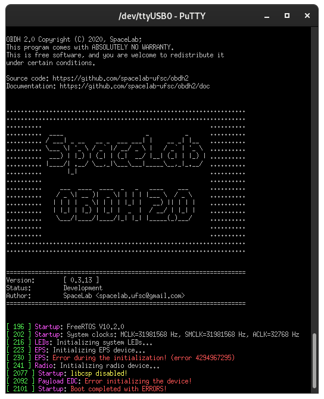
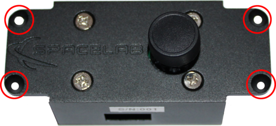
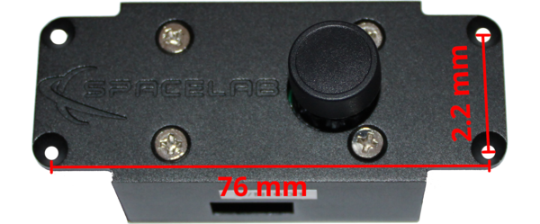

.. interfaces.rst

   Copyright The SLCam Contributors.

   SLCam Documentation

   This work is licensed under the Creative Commons Attribution-ShareAlike 4.0
   International License. To view a copy of this license,
   visit http://creativecommons.org/licenses/by-sa/4.0/.

**********
Interfaces
**********

This chapter details the interfaces of the SLCam module, dividing them into three categories: electrical, software, and mechanical interfaces. Each of these categories is described in the following sections.

Electrical
==========

All external electrical interfaces available to the user are listed in :numref:`tab:electrical-interfaces`, together with their location, connector type, and pinout.

.. _tab:electrical-interfaces:

.. list-table:: Electrical interfaces.
   :widths: 12 12 33 14 14 15
   :width: 100%
   :align: center
   :header-rows: 1

   * 
     - **Connector**
     - **Purpose**
     - **Image**
     - **Interface**
     - **Type**
     - **Pins**
   * 
     - *J1*
     - | Control/Data
       | and power
     - .. image:: img/j1-pins.png
           :width: 4cm
     - SPI/Power
     - PicoBlade
     - | 1=3V3
       | 2=GND
       | 3=MISO
       | 4=MOSI
       | 5=CLK
       | 6=CS
   *
     - *J3*
     - Programming
     - .. image:: img/j3-pins.png
           :width: 4cm
     - JTAG
     - PinHeader
     - | 1=DIO
       | 2=CLK
       | 3=3V3
       | 4=GND
   *
     - *J4*
     - Control/Data
     - .. image:: img/j4-pins.png
           :width: 4cm
     - CAN
     - PicoBlade
     - | 1=GND
       | 2=CAN High
       | 3=CAN Low
   *
     - *J5*
     - Debug
     - .. image:: img/j5-pins.png
           :width: 4cm
     - UART
     - PicoBlade
     - | 1=GND
       | 2=UART_RX
       | 3=UART_TX

.. attention::
   All pins presented in :numref:`tab:electrical-interfaces` operate at CMOS 3V3 voltage level!

Software
========

Todas as interfaces de software do módulo estão associadas as interfaces elétricas apresentadas na seção anterior. Nas subseções a seguir, os parâmetros de configuração e características de cada interface estão descritas.

Control/Data
************

The control and data interfaces allow commands to be sent and their respective responses to be received, in addition to enabling data transfer from the module to the host system, such as image transmission.

Two interfaces are available for control and data transfer: the SPI and CAN interfaces. Therefore, both interfaces provide the same functionalities and enable redundant access to the device.

The specifications required to communicate with these interfaces are described in :numref:`tab:control-spi-specs` and :numref:`tab:control-can-specs` (SPI and CAN, respectively).

.. _tab:control-spi-specs:

.. list-table:: Control/Data interface specifications (SPI port).
   :widths: 20 20
   :align: center
   :header-rows: 1

   * - **Parameter**
     - **Value**
   * - *PHY*
     - SPI
   * - *Signal Level*
     - CMOS 3V3
   * - *Mode*
     - 0 (CPHA=0/CPOL=0)
   * - *Baudrate*
     - 500 kbps
   * - *Data Link/Network Protocol*
     - CSP
   * - *Address*
     - 10

.. _tab:control-can-specs:

.. list-table:: Control/Data interface specifications (CAN port).
   :widths: 20 20
   :align: center
   :header-rows: 1

   * - **Parameter**
     - **Value**
   * - *PHY*
     - CAN
   * - *Signal Level*
     - CMOS 3V3
   * - *Type*
     - Standard CAN
   * - *Baudrate*
     - 500 kbps
   * - *Data Link/Network Protocol*
     - CSP
   * - *Address*
     - 11

Both interfaces use the CSP protocol :cite:`csp` as the data link and network layer protocol. Commands and their respective responses are transmitted within the payload field of each CSP packet (transport layer), following the format descrided in the next section. In all CSP packets, the CRC flag must be enabled.

Commands
--------

To externally control and access the SLCam module, some commands are available through the control/data interfaces of the board. A list with the commands is available in :numref:`tab:commands`. The format of the commands' answers can be seen in :numref:`tab:commands-ans`.

.. _tab:commands:

.. list-table:: List of commands.
   :widths: 10 30 40 20
   :align: center
   :header-rows: 1

   * - **ID**
     - **Name**
     - **Content**
     - **Interface**
   * - 0
     - Read Parameter
     - Param. ID (1 byte)
     - SPI, CAN
   * - 1
     - Write Parameter
     - Param. ID (1 byte), Param. Value (8 bytes)
     - SPI, CAN
   * - 2
     - Capture Single Image
     - None
     - SPI, CAN
   * - 3
     - Start Automatic Capture
     - None
     - SPI, CAN
   * - 4
     - Stop Automatic Capture
     - None
     - SPI, CAN
   * - 5
     - Read Image
     - Image ID (4 bytes)
     - SPI, CAN
   * - 6
     - Remove Image
     - Image ID (4 bytes)
     - SPI, CAN

.. _tab:commands-ans:

.. list-table:: Format of the command's answers.
   :widths: 10 45 45
   :align: center
   :header-rows: 1

   * - **ID**
     - **Name**
     - **Content**
   * - 1
     - TBD
     - TBD

Variables and Parameters
------------------------

All variables and parameters available for reading and writing are listed in :numref:`tab:parameters`. Each variable/parameter has a unique ID and can be read by an external device. As shown, some variables can also be written.

.. _tab:parameters:

.. list-table:: List of variables and parameters.
   :widths: 10 25 25 15 15 10
   :width: 100%
   :align: center
   :header-rows: 1

   * - **ID**
     - **Name**
     - **Description**
     - **Access**
     - **Type**
     - | **Length**
       | **[bytes]**
   * - 0
     - Firmware version
     - v1.2.3=0x00010203
     - Read
     - uint16
     - 2
   * - 1
     - Hardware version
     - v1.2.3=0x00010203
     - Read
     - uint16
     - 2
   * - 2
     - System Time
     - Epoch in seconds
     - Read/Write
     - uint32
     - 4
   * - 3
     - Reset Counter
     - Resets since factory reset
     - Read
     - uint32
     - 4
   * - 4
     - Operation Mode
     - TBD
     - Read/Write
     - uint8
     - 1
   * - 5
     - | Number of Available
       | Images
     - Images in memory
     - Read
     - uint16
     - 2
   * - 6
     - Image Size
     - | 0=160x120,
       | 1=176x144,
       | 2=320x240,
       | 3=352x288,
       | 4=640x480,
       | 5=800x600,
       | 6=1024x768,
       | 7=1280x1024,
       | 8=1600x1200
     - Read/Write
     - uint8
     - 1
   * - 7
     - Light Mode
     - | 0=Auto,
       | 1=Sunny,
       | 2=Cloudy,
       | 3=Office,
       | 4=Home
     - Read/Write
     - uint8
     - 1
   * - 8
     - Color Saturation
     - | 0=Saturation 0,
       | 1=Saturation 1,
       | 2=Saturation 2
     - Read/Write
     - uint8
     - 1
   * - 9
     - Brightness
     - | 0=Brightness 0,
       | 1=Brightness 1,
       | 2=Brightness 2
     - Read/Write
     - uint8
     - 1
   * - 10
     - Contrast
     - | 0=Contrast 0,
       | 1=Contrast 1,
       | 2=Contrast 2
     - Read/Write
     - uint8
     - 1
   * - 11
     - Special Effect
     - | 0=Antique,
       | 1=Bluish,
       | 2=Greenish,
       | 3=Reddish,
       | 4=Black and White,
       | 5=Negative,
       | 6=Negative Black and White,
       | 7=Normal
     - Read/Write
     - uint8
     - 1

Debug
*****

The debug interface consists of a serial port where system log messages are written and configuration and operation commands can be sent, both through a command-line terminal interface. The communication specifications of this interface are described in :numref:`tab:debug-specs`.

.. _tab:debug-specs:

.. list-table:: Debug interface specifications.
   :widths: 20 20
   :align: center
   :header-rows: 1

   * - **Parameter**
     - **Value**
   * - *PHY*
     - UART
   * - *Signal Level*
     - CMOS 3V3
   * - *Baudrate*
     - 115200 bps
   * - *Data Bits*
     - 8
   * - *Stop Bits*
     - 1
   * - *Parity*
     - None
   * - *Flow Control*
     - XON/XOFF

An example of the output of this interface when the SLCam is connected to a computer and powered on can be seen in :numref:`fig:debug-example`.

.. _fig:debug-example:

      Debug interface output example.

Programming
***********

To upload the firmware to the module, the programming interface must be used. This interface provides a JTAG port, where an ST-Link programmer must be connected for code uploading.

Mechanical
==========

The SLCam module provides two main external mechanical interfaces: the mounting structure and the optical interface of the camera lens. These interfaces are responsible for enabling the mechanical integration of the payload into the satellite structure while also providing the required optical access for image acquisition.

For structural integration, the module includes four 3.2 mm diameter through holes designed for the use of standard M3 screws. These mounting holes allow the SLCam to be securely attached to the satellite structure or to external support fixtures during integration and testing activities. The location of the mounting holes on the mechanical case is illustrated in :numref:`fig:mounting-holes`.

.. _fig:mounting-holes:

      Mounting holes of the SLCam case.

The relative spacing and distances between the mounting holes are presented in :numref:`fig:mounting-holes-distance`. These dimensions are important for the mechanical integration of the payload and must be considered during the design of the satellite support structure and assembly interfaces.

.. _fig:mounting-holes-distance:

      Distance between the mounting holes.
