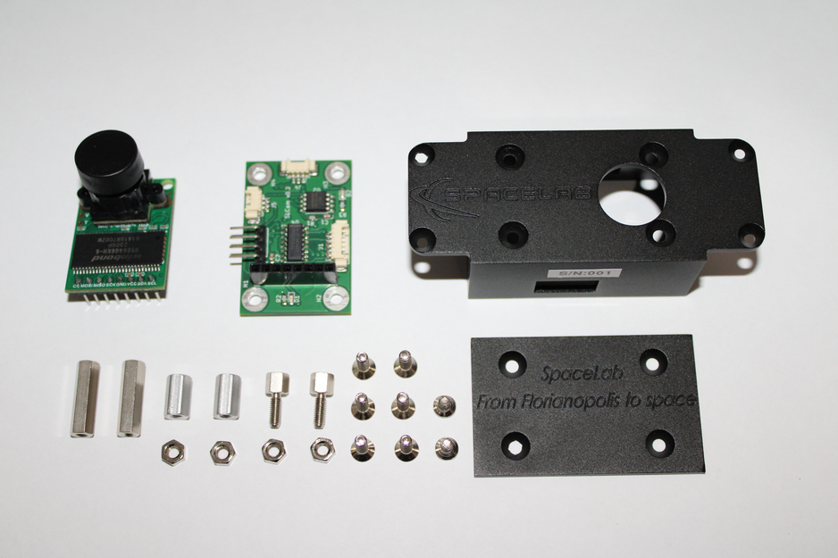

.. mechanical.rst

   Copyright The SLCam Contributors.

   SLCam Documentation

   This work is licensed under the Creative Commons Attribution-ShareAlike 4.0
   International License. To view a copy of this license,
   visit http://creativecommons.org/licenses/by-sa/4.0/.

**********
Mechanical
**********

This chapter describes the mechanical design of the SLCam module, including the structural architecture, manufacturing process, materials, dimensions, and external mechanical interfaces. The mechanical project was developed using the SolidWorks CAD software :cite:`solidworks`, allowing the creation of the complete three-dimensional model of the payload and the verification of the assembly and integration requirements.

The SLCam mechanical structure was designed to provide adequate protection for the electronic boards and optical components while maintaining reduced size and mass, which are critical requirements for nanosatellite applications. The mechanical assembly is composed of a machined aluminum enclosure, internal support spacers, fastening screws, and the optical opening for the camera lens. All parts of the mechanical assembly are shown in :numref:`fig:slcam-parts`.

.. _fig:slcam-parts:

   Exploded view of the SLCam mechanical assembly.

As illustrated in :numref:`fig:slcam-parts`, the mechanical structure is composed of two main enclosure parts: the main body and the bottom cover. The main body accommodates the controller board and the image sensor assembly, while the removable cover provides access to the internal electronics during integration and maintenance procedures. Metallic spacers and fastening screws are used to mechanically secure the printed circuit boards and maintain the required alignment between the controller board and the image sensor module.

The optical interface is located on the upper surface of the enclosure, where a circular opening allows the camera lens to capture images outside the module. The enclosure also includes external openings for electrical connectors and integration interfaces. Additionally, engraved inscriptions are present on the external surfaces of the case for identification and traceability purposes.

The enclosure was manufactured from 7075 aluminum alloy using a CNC milling process. This material was selected due to its high mechanical strength, low density, and suitability for aerospace and embedded applications. After machining, all external and internal surfaces of the enclosure received an anodization treatment to improve corrosion resistance, surface hardness, and long-term durability.

The SLCam module has compact dimensions suitable for CubeSat-class payloads. The dimensions of the main structural core are 54.0 :math:`\times` 26.1 :math:`\times` 34.1 mm, while the overall envelope dimensions are 82.2 :math:`\times` 34.8 :math:`\times` 34.1 mm. The total mass of the module is approximately 67 g, including the enclosure, electronics, fasteners, and optical assembly.

For structural integration into the satellite platform, the mechanical case includes mounting holes compatible with M3 screws, allowing secure attachment to the spacecraft structure. The positions and spacing of these mounting interfaces are described in the following sections.
