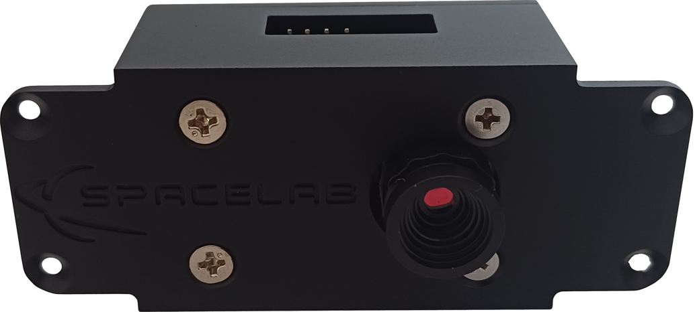

.. overview.rst

   Copyright The SLCam Contributors.

   SLCam Documentation

   This work is licensed under the Creative Commons Attribution-ShareAlike 4.0
   International License. To view a copy of this license,
   visit http://creativecommons.org/licenses/by-sa/4.0/.

********
Overview
********

The SLCam is a controller for a image sensor module designed to be used in nanosatellite missions. The main object is to take pictures of the Earth from space. It's the first project from SpaceLab using cameras in payloads.

.. _fig:slcam-mounted:

      SLCam.

Specifications
==============

The SLCam has the image sensor module Arducam Mini 2MP Plus, one microcontroller (STM32F103C8T6) that run at a clock of **TBD**, a RAM of 20 kB (SRAM), a flash memory of **64 or 128KBytes**. The SLCam also has a CAN Transceiver, a switch and many connectors such as CAN connector, JTAG, SPI/3V3 and one for the image sensor.

.. list-table:: General specifications of the SLCam module.
    :widths: 30 70
    :align: center
    :header-rows: 1

    *
      - **Parameter**
      - **Value**
    *
      - *Sensor type*
      - RGB
    *
      - *Pixel size*
      - 2.2 :math:`\times` 2.2 :math:`\mu` m
    *
      - *Max. Resolution*
      - 1600 :math:`\times` 1200 px
    *
      - *Field of View (FoV)*
      - :math:`68^{\circ}` (6 mm) **TBC**
    *
      - *Storage*
      - 16 MB (Flash NOR)
    *
      - *Power Supply*
      - 3V3 @ 140 mA **TBC**
    *
      - *Control/Data Interface*
      - SPI and/or CAN
    *
      - *Debug Interface*
      - UART
    *
      - *Programming*
      - JTAG

Product tree
============

The product tree of the SLCam payload can be divided into five branches: hardware, firmware, mechanical, software and documentation. A diagram of the product tree is available in :numref:`fig:product-tree`.

.. _fig:product-tree:

.. figure:: img/product-tree.*
      :width: 100%
      :align: center
      :alt: Product tree

      Product tree of the SLCam Payload.
