.. usage.rst

   Copyright The SLCam Contributors.

   SLCam Documentation

   This work is licensed under the Creative Commons Attribution-ShareAlike 4.0
   International License. To view a copy of this license,
   visit http://creativecommons.org/licenses/by-sa/4.0/.

******************
Usage Instructions
******************

Assembly
========

This section describes the recommended assembly procedure for the SLCam module. The assembly sequence presented below follows the order illustrated in the figures and ensures the correct mechanical alignment between the controller board, the image sensor module, and the external enclosure.

#. **Prepare the base plate and fastening screws**

Start the assembly by positioning the four mounting screws into the base plate holes, as shown in :numref:`fig:assembly-step1`.

.. _fig:assembly-step1:

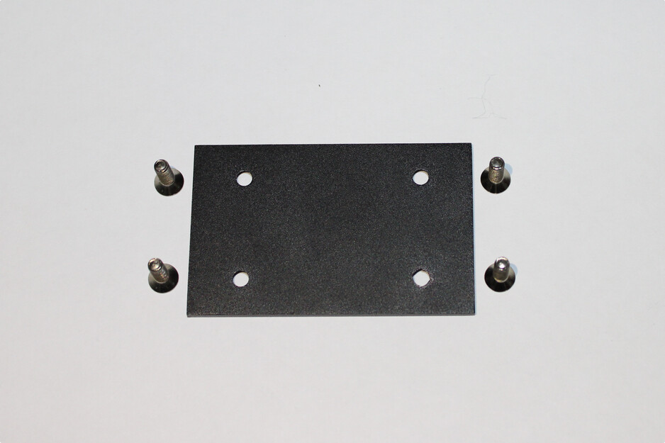

      Step 1 of the assembly sequence.

#. **Fix the screws using nuts**

Secure the screws to the base plate using the corresponding nuts on the opposite side of the plate. This step creates the mechanical support structure used for mounting the electronic boards.

.. _fig:assembly-step2:

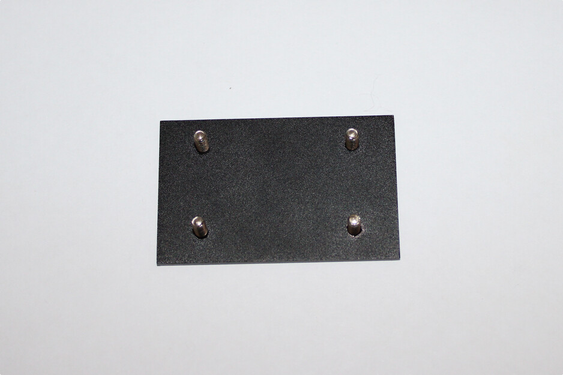

      Step 2 of the assembly sequence.

#. **Install the controller board**

Place the controller board onto the mounted screws, aligning the PCB mounting holes with the screw positions, as illustrated in :numref:`fig:assembly-step3`.

.. _fig:assembly-step3:

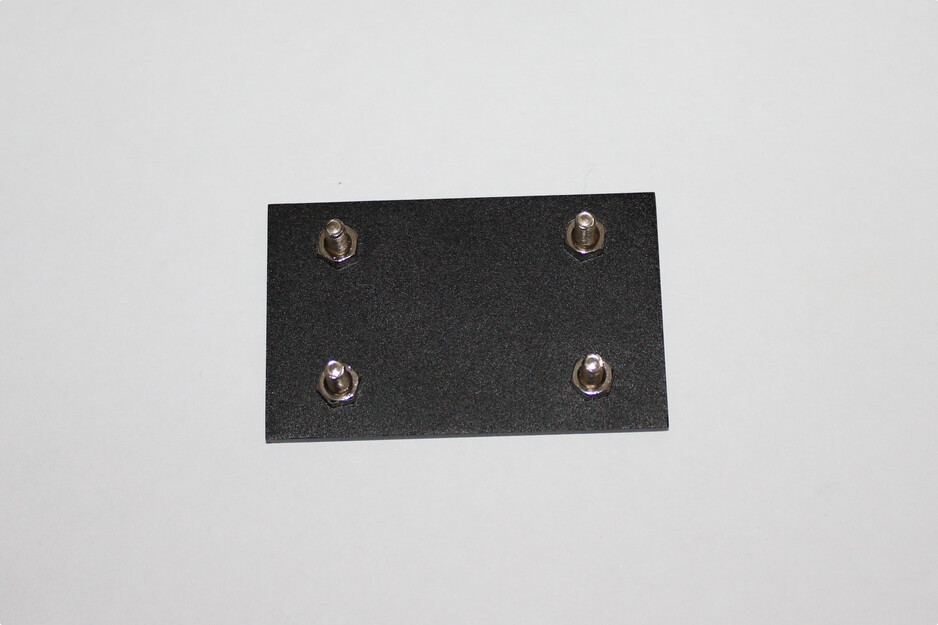

      Step 3 of the assembly sequence.

#. **Install the metallic spacers**

Attach the metallic spacers above the controller board using the threaded screws. These spacers define the vertical distance between the controller board and the image sensor module while also providing mechanical rigidity to the structure.

.. _fig:assembly-step4:

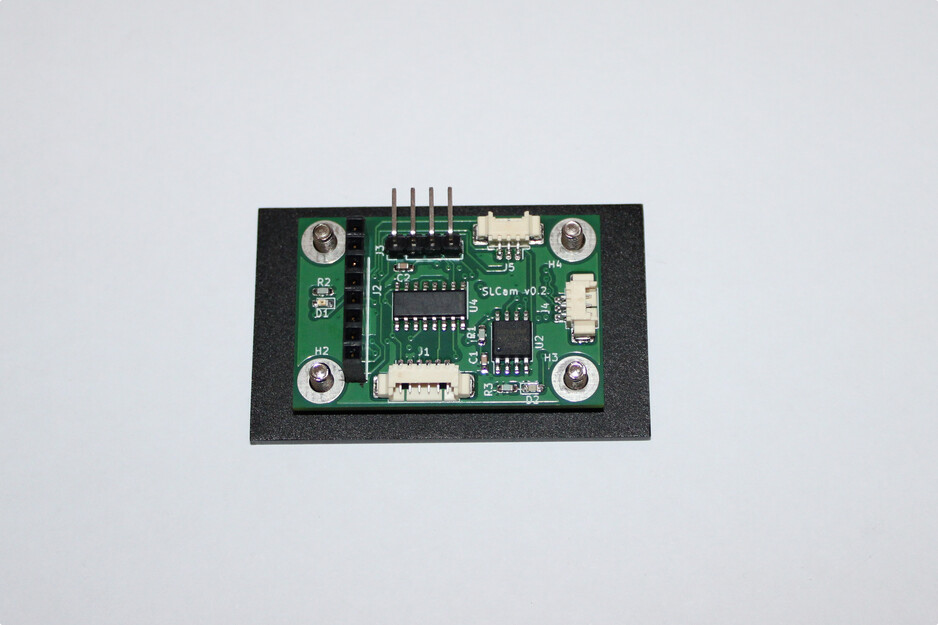

      Step 4 of the assembly sequence.

#. **Prepare the image sensor module**

Install the fastening screws and support spacers on the Arducam image sensor board. Protective foam pads may also be positioned near the mounting points to reduce mechanical stress and vibrations during operation.

.. _fig:assembly-step5:

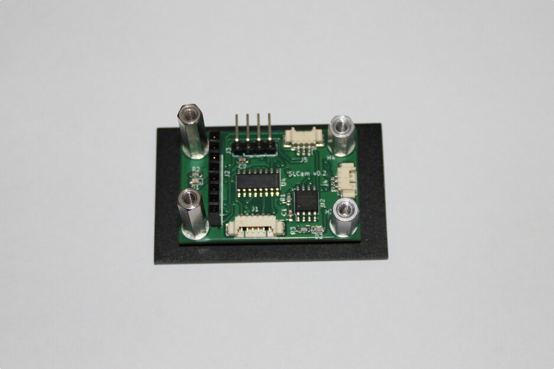

      Step 5 of the assembly sequence.

#. **Mount the image sensor board**

Position the image sensor board above the controller board, aligning the spacers and connector interfaces. The camera module should remain parallel to the controller board to ensure proper optical alignment.

.. _fig:assembly-step6:

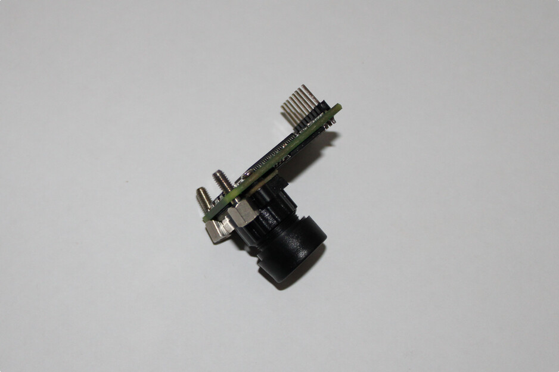

      Step 6 of the assembly sequence.

#. **Connect the image sensor interface**

Carefully connect the image sensor board to the controller board through the dedicated header connector. Verify that all connector pins are properly aligned before applying force to the assembly.

.. _fig:assembly-step7:

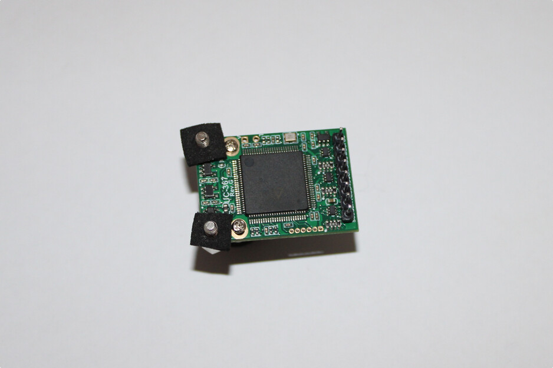

      Step 7 of the assembly sequence.

#. **Verify the internal assembly**

After the installation of both electronic boards, inspect the mechanical alignment, connector engagement, and spacer fixation. An assembled internal structure is shown in :numref:`fig:assembly-step8`.

.. _fig:assembly-step8:

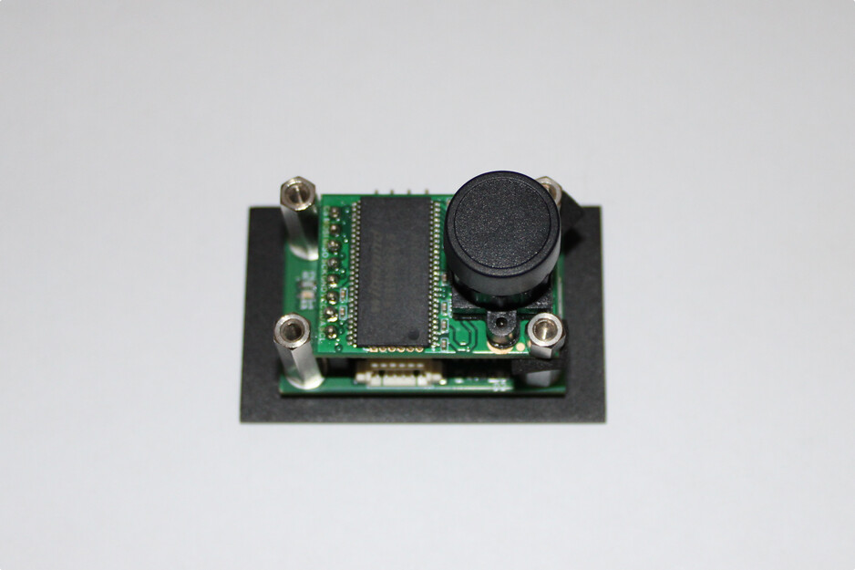

      Step 8 of the assembly sequence.

#. **Insert the assembly into the enclosure**

Position the assembled electronic structure inside the aluminum enclosure. Ensure that the camera lens is aligned with the optical opening of the case and that the external connectors are properly positioned relative to the case openings.

.. _fig:assembly-step9:

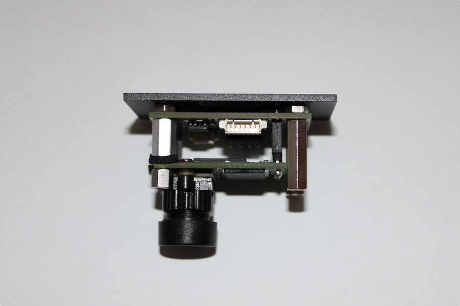

      Step 9 of the assembly sequence.

#. **Fix the top cover**

Install the top cover of the enclosure and secure it using the fastening screws, as shown in :numref:`fig:assembly-step10`.

.. _fig:assembly-step10:

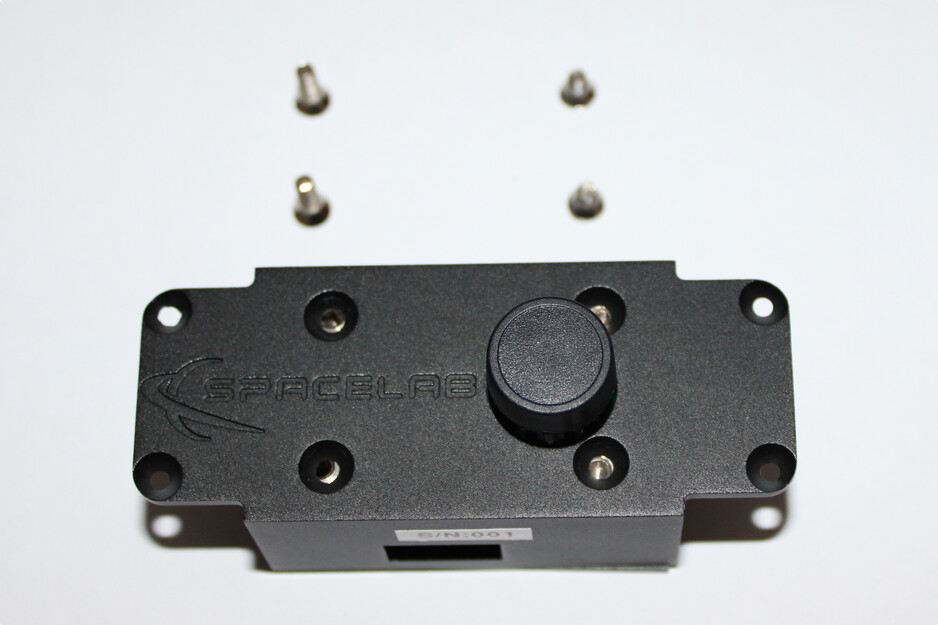

      Step 10 of the assembly sequence.

#. **Final inspection**

After completing the assembly, perform a final inspection of the module, verifying the mechanical fixation, connector accessibility, optical alignment, and enclosure closure integrity. The final assembled SLCam module is illustrated in :numref:`fig:assembly-step11`.

.. _fig:assembly-step11:

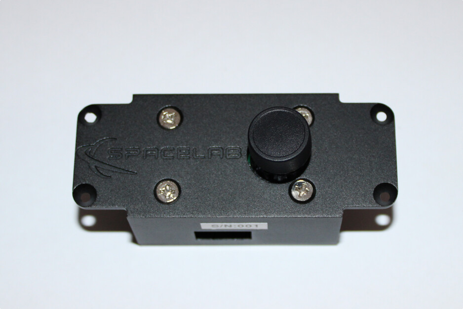

      Step 11 of the assembly sequence.

The assembly procedure described above is intended for laboratory integration and prototype assembly. During flight-model assembly, additional procedures such as torque control, thread-locking compounds, cleanliness verification, and vibration-resistant fixation methods may also be required.

Firmware Upload
===============

.. note::
   TODO
